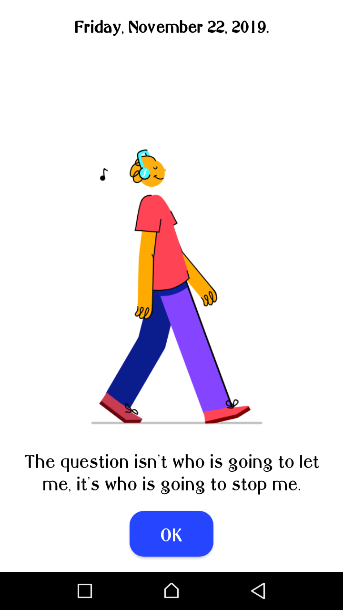
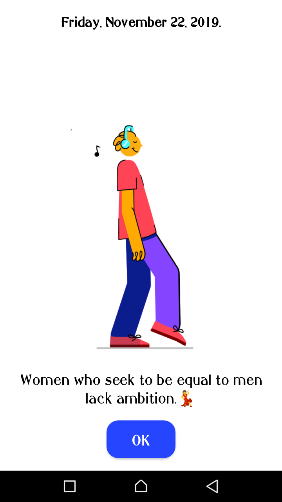
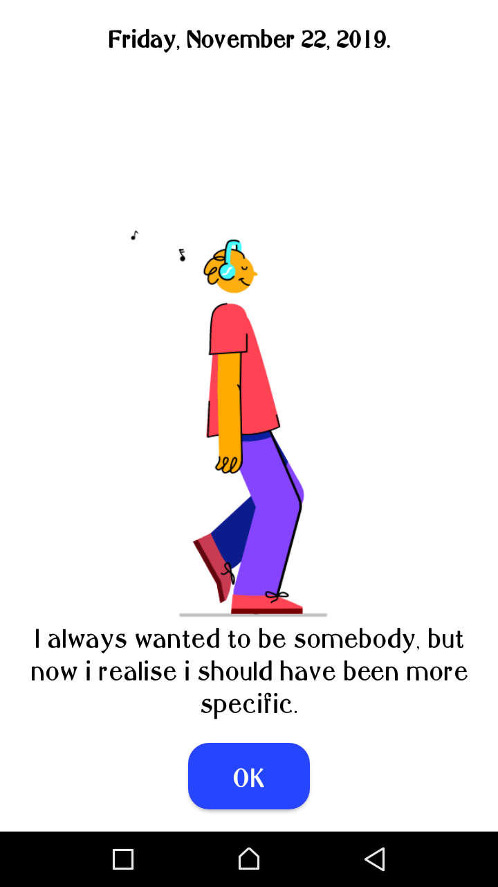

# NOTEit.
 A simple notebook app using MVVM architecture.

 The app features MVVM components such as:
 - _Room DB_ -For offline storage of user's notes.
 - _Livedata_ -For data persistance.

 >You can download the app [here](https://drive.google.com/open?id=1In0qyn9wbha9hLzzZyW_0yWLrFHoPKLr "Download NOTEit ")

 # Prequisites
You will need the following to run this project:
1. A desktop computer or laptop with access to the internet.
2. Android Studio.

# Setting Up
- Clone the repository from github. Use : [https://github.com/VictorKabata/NOTEit.git](https://github.com/VictorKabata/NOTEit.git "Cloning URL")
- Open the project using Android Studio IDE.

# Application Walkthrough
## Welcome Activity.

This page features the current date, a groovy animation and daily quotes that change at random on app start.

## Dashboard Activity
This is the main activity of the application where the user can see the notes they add.

_Add dashboard screenshots here_

## Add Notes Activity
This is where the user can enter the notes. They have to enter the note title and description and save the note.

_Add add notes screenshots here_
